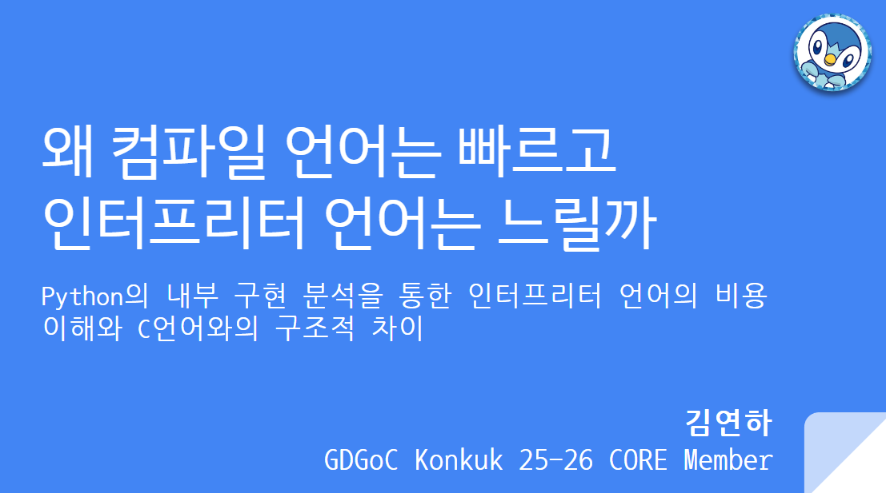

# GDGoC Konkuk compiled vs interpreted 발표

GDGoC Konkuk 2025년 하반기 세션 발표자료입니다.

- 주제: 왜 컴파일 언어는 빠르고 인터프리터 언어는 느릴까?  
- 일시: 2025년 12월 2일  
- 장소: 건국대학교 공학관 D동 X-Space

---

## 발표에서 다루는 내용

- 컴파일 언어 vs 인터프리터 언어 실행 과정 비교
- 컴파일 타임 vs 런타임 trade-off
- 정적 타입 vs 동적 타입
- C의 POD 메모리 레이아웃 vs Python Object Model
- CPython 내부 구조(바이트코드 컴파일, VM eval loop 등)
- 정적 디스패치 vs 동적 디스패치
- vtable 기반 접근 vs 딕셔너리 기반 lookup
- 최적화 가능 범위 차이
